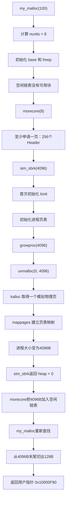
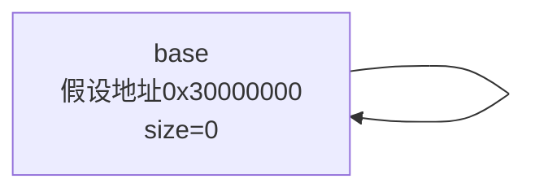
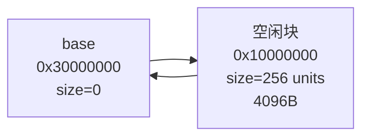
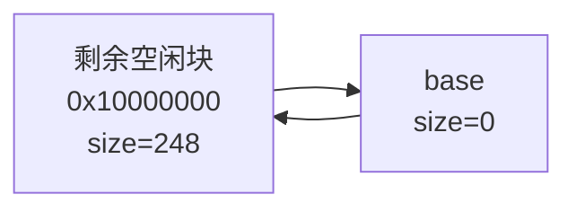
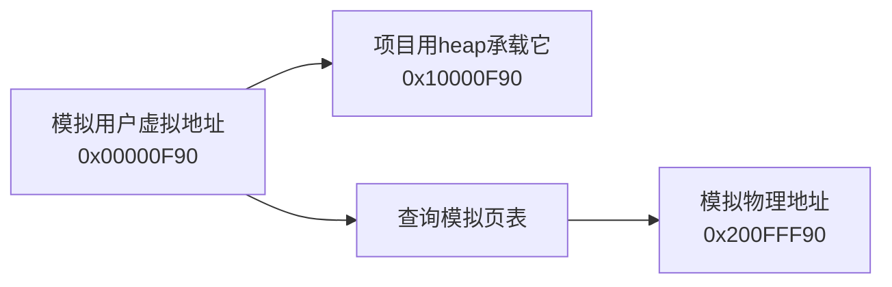
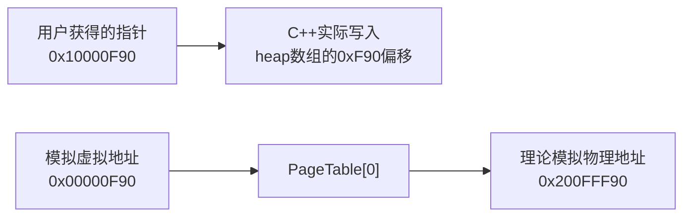
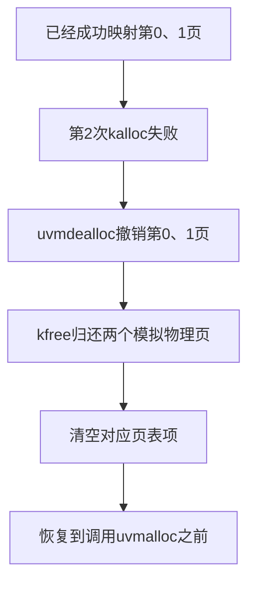
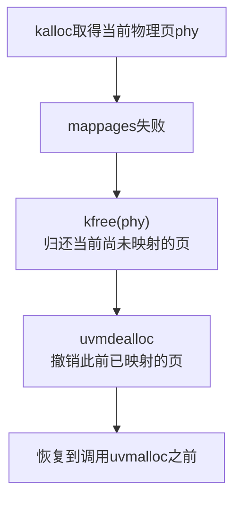
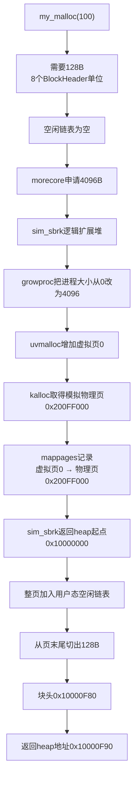
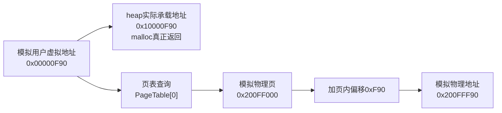

# 一个帮助理解的实例：第一次调用 `my_malloc(100)`

本文通过一组假设地址，完整模拟下面这次调用：

```cpp
void* ptr = my_malloc(100);
```

目标是说明：

- `my_malloc` 如何计算并切分小内存块；
- 空闲链表不足时如何经过 `morecore` 和 `sim_sbrk` 扩大堆；
- `growproc`、`uvmalloc`、`kalloc` 和 `mappages` 如何协作；
- 分配中途失败时为什么需要回滚；
- 模拟虚拟地址、模拟物理地址和 `heap` 中实际 C++ 地址的关系；
- `my_malloc` 最终返回的究竟是哪一种地址。

> 本文中的地址都是为了方便计算而假设的，不是程序每次运行时的真实地址。

---

## 一、先理解项目中的四个层次


各层管理的单位不同：

| 层次 | 主要管理对象 | 常用单位 |
|---|---|---|
| `my_malloc` | 大小不同的小内存块 | `BlockHeader` 单位 |
| `sim_sbrk`、`growproc` | 进程堆大小 | 字节 |
| `uvmalloc`、`mappages` | 虚拟页与页表项 | 页、虚拟地址 |
| `kalloc`、`kfree` | 固定大小的物理页 | 4096B 物理页 |

---

## 二、本次演示的假设

假设：

```text
sizeof(BlockHeader) = 16B
kPageSize           = 4096B
kHeapSize           = 1MB
kPhysicalMemorySize = 1MB

heap 的宿主机地址起点             = 0x10000000
physical_memory 的宿主机地址起点 = 0x20000000
哨兵 base 的假设地址             = 0x30000000
```

这里的两个数组分别承担不同角色：

```cpp
alignas(16) unsigned char heap[kHeapSize];

alignas(kPageSize)
unsigned char physical_memory[kPhysicalMemorySize];
```

```text
heap
  作为“模拟用户虚拟堆”的实际 C++ 数据缓冲区
  my_malloc 返回的普通指针落在这个数组中

physical_memory
  作为“模拟物理内存”
  kalloc/kfree 在这个数组中分配和回收4096B页面
```

两块数组都是 Windows 进程中的普通内存。我们只是赋予它们不同的模拟角色。

---

## 三、调用之前的状态

第一次调用 `my_malloc` 之前：

```text
freep = nullptr
memory_system_initialized = false
current_process.size = 0
```

此时物理页分配器和进程页表还没有初始化。

从模拟操作系统的角度看：

```text
进程逻辑堆大小：0B
已经映射的虚拟页：0页
已经取得的模拟物理页：0页
```

虽然 `heap` 数组在 C++ 层面已经完整存在，但项目通过
`current_process.size` 规定目前逻辑上还不能分配其中的任何区域。

---

## 四、完整调用链



---

## 五、第一步：`my_malloc` 计算需要多少空间

用户调用：

```cpp
void* ptr = my_malloc(100);
```

`my_malloc` 使用下面的公式：

```cpp
std::size_t nunits =
    (size + sizeof(BlockHeader) - 1)
    / sizeof(BlockHeader)
    + 1;
```

代入：

```text
size = 100
sizeof(BlockHeader) = 16
```

得到：

```text
nunits = (100 + 16 - 1) / 16 + 1
       = 115 / 16 + 1
       = 7 + 1
       = 8
```

所以本次实际需要：

```text
8 × 16B = 128B
```

内存块布局：

```text
┌──────────────────┬─────────────────────────────────┐
│ 16B BlockHeader  │ 112B用户区，其中请求使用100B     │
└──────────────────┴─────────────────────────────────┘
                  总共128B
```

### 本环节知识点：向上取整

100B 不能被16B整除，因此先把100B向上取整为112B，再添加16B块头。

多出来的12B是对齐造成的内部碎片：

```text
112B - 100B = 12B
```

---

## 六、第二步：初始化哨兵节点

因为第一次调用时：

```cpp
freep == nullptr
```

所以初始化：

```cpp
base.ptr = &base;
base.size = 0;
freep = prep = &base;
```

此时空闲链表中只有哨兵节点：



### 本环节知识点：哨兵节点

`base` 不对应任何真实堆内存，`size` 固定为0。它的作用是：

- 让空闲链表即使没有真实空闲块也保持一个合法循环；
- 减少插入第一个节点、删除最后一个节点时的特殊分支；
- 为遍历完整个循环链表提供判断位置。

---

## 七、第三步：空闲链表没有可用内存

`my_malloc` 从下面的位置开始查找：

```cpp
p = prep->ptr;
```

当前：

```text
prep = &base
prep->ptr = &base
p = &base
p->size = 0
```

但是本次需要：

```text
nunits = 8
```

因此哨兵不可能满足申请。遍历一圈后再次到达 `freep`，说明空闲链表中没有合适内存，于是调用：

```cpp
morecore(8);
```

---

## 八、第四步：`morecore` 将申请提升到一整页

虽然 `my_malloc` 只缺少8个 `BlockHeader` 单位，但 `morecore` 规定每次至少扩展一页：

```cpp
std::size_t min_units = kPageSize / sizeof(BlockHeader);
```

计算：

```text
min_units = 4096 / 16
          = 256
```

因为：

```text
8 < 256
```

所以：

```text
nunits = 256
bytes = 256 × 16
      = 4096B
```

接下来调用：

```cpp
sim_sbrk(4096);
```

### 本环节知识点：批量申请

如果每次 `malloc(100)` 都向下层申请大约100B，调用下层内存管理的次数会很多。

因此用户态分配器一次至少申请一页，再把这一页切成多个小块慢慢使用。后续的小分配通常只需要在空闲链表中查找，不必再次调用 `sim_sbrk`。

---

## 九、第五步：`sim_sbrk` 首次初始化内存系统

第一次进入 `sim_sbrk` 时：

```text
memory_system_initialized = false
```

所以执行：

```cpp
kinit();
process_memory_init(current_process);
memory_system_initialized = true;
```

### 9.1 `kinit` 初始化模拟物理页

`physical_memory` 是1MB：

```text
1MB / 4096B = 256个模拟物理页
```

假设 `physical_memory` 起点为：

```text
0x20000000
```

那么各页为：

```text
物理页0：  0x20000000 ～ 0x20000FFF
物理页1：  0x20001000 ～ 0x20001FFF
物理页2：  0x20002000 ～ 0x20002FFF
...
物理页255：0x200FF000 ～ 0x200FFFFF
```

`kinit` 通过 `kfree` 使用头插法将每一页加入空闲页链表。初始化完成后：


```text
free_pages_count = 256
```

### 9.2 `process_memory_init` 初始化进程内存

初始化后：

```text
current_process.size = 0
```

页表中的所有项都是：

```text
valid = false
physical_page = nullptr
```

---

## 十、第六步：`growproc` 扩大进程地址空间

`sim_sbrk` 先保存扩展前的堆顶：

```cpp
std::size_t old_size = current_process.size;
```

所以：

```text
old_size = 0
```

然后执行：

```cpp
growproc(current_process, 4096);
```

`growproc` 首先检查：

```text
process.size + bytes
```

是否超过模拟虚拟地址空间上限，并避免无符号整数加法溢出。

检查成功后调用：

```cpp
uvmalloc(process.page_table, 0, 4096);
```

### 本环节知识点：先完成底层操作，再更新进程大小

`growproc` 只有在 `uvmalloc` 完全成功后才执行：

```cpp
process.size += bytes;
```

这样可以保证：

```text
process.size
```

与页表中实际建立的映射保持一致。

如果 `uvmalloc` 失败，`process.size` 仍然保持旧值0。

---

## 十一、第七步：`uvmalloc` 增加虚拟页

调用参数：

```text
old_size = 0
new_size = 4096
```

计算旧、新大小分别占用多少页：

```text
old_page = ceil(0 / 4096)
         = 0

new_page = ceil(4096 / 4096)
         = 1
```

因此需要新增：

```text
1 - 0 = 1页
```

### 11.1 `kalloc` 取得一个模拟物理页

调用：

```cpp
void* phy = kalloc();
```

`kalloc` 从空闲物理页链表头取出：

```text
phy = 0x200FF000
```

状态变成：

```text
已经分配的模拟物理页：1个
剩余空闲模拟物理页：255个
free_pages_count = 255
```

### 11.2 `mappages` 建立模拟页表映射

调用：

```cpp
mappages(page_table, 0, 0x200FF000);
```

虚拟地址0属于虚拟页0，因此建立：

```text
虚拟页0 → 模拟物理页0x200FF000
```


页表状态：

| 页表下标 | 模拟虚拟地址范围 | `physical_page` | `valid` |
|---:|---|---|---|
| 0 | `0x0000～0x0FFF` | `0x200FF000` | `true` |
| 1 | `0x1000～0x1FFF` | `nullptr` | `false` |
| 2 | `0x2000～0x2FFF` | `nullptr` | `false` |

`uvmalloc` 成功返回后，`growproc` 更新：

```text
current_process.size = 4096
```

---

## 十二、第八步：`sim_sbrk` 返回新增区间起点

扩展前：

```text
old_size = 0
```

扩展后：

```text
current_process.size = 4096
```

于是：

```cpp
void* old_p = heap + old_size;
```

得到：

```text
old_p = 0x10000000 + 0
      = 0x10000000
```

它代表本次新增逻辑堆区间的起点：

```text
[0x10000000, 0x10001000)
```

区间大小正好是4096B。

### 本环节知识点：这里只是逻辑扩展

`heap` 数组在 C++ 程序启动时就已经完整存在。`heap + old_size`：

- 不会向 Windows 重新申请内存；
- 不会修改真正的硬件访问权限；
- 只是计算 `heap` 数组中的一个地址；
- 通过 `current_process.size` 逻辑上规定哪些前缀区域已经可以交给分配器使用。

真正的模拟物理页申请和页表登记已经由：

```text
growproc → uvmalloc → kalloc + mappages
```

完成。

---

## 十三、第九步：`morecore` 将新区域加入空闲链表

`morecore` 得到：

```text
p = 0x10000000
```

它在整页开头写入块头：

```cpp
p->size = 256;
```

表示这个块总共包含256个 `BlockHeader` 单位，也就是4096B。

接着调用：

```cpp
my_free(p + 1);
```

传入：

```text
p + 1 = 0x10000010
```

`my_free` 会执行：

```cpp
bp = static_cast<BlockHeader*>(ptr) - 1;
```

重新得到块头：

```text
bp = 0x10000000
```

然后把整个4096B区域加入空闲链表：



### 本环节知识点：为什么调用 `my_free(p + 1)`

`my_free` 的参数约定是用户数据区指针，而不是块头指针。

因此：

```text
p       指向BlockHeader
p + 1   指向块头后面的用户数据区
```

调用 `my_free(p + 1)` 后，`my_free` 再减去一个 `BlockHeader` 找回 `p`。

这样新增的大块和普通用户释放的小块走相同的空闲链表插入、排序和合并逻辑。

---

## 十四、第十步：`my_malloc` 重新查找并切分

现在空闲链表中有一个4096B块：

```text
块起点 = 0x10000000
size = 256个单位
     = 4096B
```

本次只需要：

```text
8个单位
= 128B
```

因此从空闲块末尾切出128B。

先缩小剩余空闲块：

```text
256 - 8 = 248个单位
```

换算成字节：

```text
248 × 16 = 3968B = 0xF80
```

分配块头部地址：

```text
0x10000000 + 248 × 16
= 0x10000000 + 0xF80
= 0x10000F80
```

内存布局：

```text
heap起点                                                    heap+4096
0x10000000                                                   0x10001000
    │                                                             │
    ▼                                                             ▼
┌──────────────────────────────────────────┬──────────────┬───────────────┐
│ 剩余空闲块                               │ 分配块头部   │ 用户数据区    │
│ 248 units = 3968B                        │ 16B          │ 112B          │
│ 0x10000000 ～ 0x10000F7F                │ 0x10000F80   │ 0x10000F90    │
└──────────────────────────────────────────┴──────────────┴───────────────┘
```


最后执行：

```cpp
return static_cast<void*>(p + 1);
```

所以：

```text
my_malloc(100)最终返回0x10000F90
```

它满足16B对齐：

```text
0x10000F90 % 16 = 0
```

---

## 十五、分配成功后的全部状态

### 15.1 用户得到的指针

```text
ptr = 0x10000F90
```

它是：

```text
heap + 0xF90
```

也就是指向 `heap` 数组内部的普通 C++ 指针。

### 15.2 分配块

```text
块头地址：0x10000F80
块头大小：16B
块总大小：128B
用户区容量：112B
用户申请：100B
对齐余量：12B
```

### 15.3 用户态空闲链表



### 15.4 进程状态

```text
current_process.size = 4096B
```

### 15.5 模拟页表

```text
PageTable[0]:
    valid = true
    physical_page = 0x200FF000
```

即：

```text
模拟虚拟页0 → 模拟物理页0x200FF000
```

### 15.6 模拟物理页分配器

```text
已分配模拟物理页：1个
空闲模拟物理页：255个
```

---

## 十六、三种地址的最终对应关系

这是整个实例最重要的部分。

用户获得的块位于本页的偏移：

```text
0xF90
```

因此有以下三种地址。

### 16.1 模拟用户虚拟地址

项目把进程虚拟地址空间看成从0开始，因此：

```text
模拟用户虚拟地址 = 0x00000F90
```

将它拆分：

```text
虚拟页号 = 0xF90 / 4096 = 0
页内偏移 = 0xF90
```

### 16.2 模拟物理地址

页表记录：

```text
虚拟页0 → 模拟物理页0x200FF000
```

所以按照模拟页表进行翻译：

```text
模拟物理地址
    = 模拟物理页起点 + 页内偏移
    = 0x200FF000 + 0xF90
    = 0x200FFF90
```

### 16.3 `heap` 中实际返回的 C++ 地址

因为项目没有真实 MMU，普通 C++ 指针不能自动使用我们定义的 `PageTable`。

因此项目用 `heap` 中相同偏移的位置承载用户数据：

```text
heap地址
    = heap起点 + 模拟虚拟地址偏移
    = 0x10000000 + 0xF90
    = 0x10000F90
```

最终关系：



也可以写成：

```text
模拟用户虚拟地址：
0x00000F90

        ├── 项目实际返回的heap地址
        │   0x10000000 + 0xF90
        │ = 0x10000F90
        │
        └── 模拟页表翻译出的模拟物理地址
            0x200FF000 + 0xF90
          = 0x200FFF90
```

### 地址对照表

| 名称 | 本例地址 | 实际作用 |
|---|---:|---|
| 模拟用户虚拟地址 | `0x00000F90` | 表示进程虚拟地址空间中的偏移 |
| `heap` 中的宿主机地址 | `0x10000F90` | `my_malloc` 实际返回，C++代码真正读写 |
| 模拟物理地址 | `0x200FFF90` | 根据模拟页表计算出的理论目标 |
| 计算机真正的硬件物理地址 | 未知 | 由Windows和真实CPU页表管理，本项目无法直接观察 |

### 必须明确的结论

`my_malloc(100)` 最终返回的是：

```text
0x10000F90
```

也就是：

```text
heap + 0xF90
```

它不是：

```text
模拟虚拟地址0xF90本身
```

也不是：

```text
模拟物理地址0x200FFF90
```

---

## 十七、用户写入数据时究竟发生什么

假设：

```cpp
auto* data = static_cast<unsigned char*>(ptr);
data[0] = 'A';
```

因为：

```text
ptr = 0x10000F90
```

所以 C++ 实际执行：

```text
heap[0xF90] = 'A'
```

即写入假设宿主机地址：

```text
0x10000F90
```



当前项目不会把：

```text
0x10000F90的写入
```

自动同步到：

```text
0x200FFF90
```

原因是：

- CPU 不认识我们自己定义的 `PageTable`；
- `PageTable` 只是一个普通 C++ 数据结构；
- 项目没有真正修改 CPU 使用的硬件页表；
- `heap` 和 `physical_memory` 是两个独立数组。

### 与真实操作系统的区别

真实操作系统中：


而本项目中：


因此本项目的目标是理解内存分配控制流程，而不是实现真正的硬件地址翻译。

---

## 十八、页表到底对应哪一个地址

页表并不保存：

```text
0x10000F90 → 0x200FFF90
```

它保存的是页级映射：

```text
虚拟页0 → 模拟物理页0x200FF000
```

访问任意模拟虚拟地址时，需要保留页内偏移：

```text
模拟虚拟地址 = 虚拟页号 × 4096 + 页内偏移
模拟物理地址 = 物理页起点 + 页内偏移
```

本例：

```text
0xF90
    = 0 × 4096 + 0xF90

0x200FFF90
    = 0x200FF000 + 0xF90
```

如果访问模拟虚拟地址 `0x100`：

```text
PageTable[0]仍然提供物理页0x200FF000
模拟物理地址 = 0x200FF000 + 0x100
             = 0x200FF100
```

页表负责页级对应，页内偏移在翻译时原样保留。

---

## 十九、失败回滚是如何工作的

本例中所有操作都成功，因此没有真正触发回滚。但 `uvmalloc` 必须考虑分配多页时中途失败。

假设进程想一次增加3页：

```text
旧大小：0页
目标大小：3页
```

执行过程可能是：

```text
第0页：kalloc成功，mappages成功
第1页：kalloc成功，mappages成功
第2页：kalloc失败
```

此时不能直接返回 `false`，否则前两页会遗留在页表中，并且不会回到物理页空闲链表。

调用方看到的是“扩展失败”，但系统内部却已经损失了两页，形成资源泄漏和状态不一致。

### 19.1 `mapped_end` 的作用

`uvmalloc` 使用：

```cpp
std::size_t mapped_end = old_page * kPageSize;
```

记录已经成功映射到什么字节位置。

每成功映射一页：

```cpp
mapped_end += kPageSize;
```

例如：

```text
开始前：mapped_end = 0
第0页成功：mapped_end = 4096
第1页成功：mapped_end = 8192
第2页失败：mapped_end仍然是8192
```

这表示：

```text
[0, 8192)
```

是本轮已经成功增加、现在需要撤销的区间。

### 19.2 `kalloc` 失败

如果：

```cpp
phy == nullptr
```

说明当前页根本没有取得，但此前映射的页仍然需要释放：

```cpp
uvmdealloc(page_table, mapped_end, old_size);
```

`uvmdealloc` 会：

1. 找出本轮已经增加的页表项；
2. 对每个 `physical_page` 调用 `kfree`；
3. 将页表项设为无效；
4. 将 `physical_page` 清空。



### 19.3 `mappages` 失败

另一种情况是：

```text
kalloc成功
但mappages失败
```

这时刚取得的 `phy` 还没有进入页表，所以需要先单独归还：

```cpp
kfree(phy);
```

然后再回滚此前已经成功进入页表的页面：

```cpp
uvmdealloc(page_table, mapped_end, old_size);
```



不能只调用 `uvmdealloc`，因为当前 `phy` 尚未记录在页表里，`uvmdealloc` 找不到它。

### 19.4 回滚需要保证的性质

从调用者角度，`uvmalloc` 应尽量表现为：

```text
要么全部成功
要么失败后恢复原状
```

成功时：

```text
页表增加全部目标映射
物理页数量相应减少
growproc更新process.size
```

失败时：

```text
撤销本轮所有新映射
归还本轮取得的所有物理页
process.size保持旧值
```

这是一种简化的事务思想，也叫“失败原子性”。

---

## 二十、如果后来调用 `my_free(ptr)`

假设用户执行：

```cpp
my_free(ptr);
```

传入：

```text
ptr = 0x10000F90
```

`my_free` 先减去一个块头：

```text
BlockHeader地址
    = 0x10000F90 - 16
    = 0x10000F80
```

然后将该128B块插回空闲链表，并尝试与前后相邻空闲块合并。

本例中前面的3968B也是空闲块，并且：

```text
0x10000000 + 3968
= 0x10000F80
```

正好等于被释放块的头部地址，因此二者可以合并回完整4096B：

```text
0x10000000 ～ 0x10000FFF
```

但要注意：

```text
my_free只把小块还给用户态空闲链表
```

它不会：

- 减少 `current_process.size`；
- 删除页表映射；
- 调用 `kfree`；
- 将整页归还给物理页分配器。

整页级释放属于：

```text
uvmdealloc → kfree
```

这一层的职责。

---

## 二十一、为什么后续小分配通常不会再走完整链路

第一次 `my_malloc(100)` 后还剩下：

```text
3968B空闲空间
```

如果随后调用：

```cpp
my_malloc(64);
```

`my_malloc` 可以直接从现有空闲块切分，不需要调用：

```text
morecore
sim_sbrk
growproc
uvmalloc
kalloc
mappages
```

只有当用户态空闲链表无法找到足够大的块时，才会再次走完整扩展链路。

---

## 二十二、本例的最终总结图



地址关系最终为：



最后只需要记住：

```text
my_malloc真正返回：
0x10000F90

它在模拟进程虚拟地址空间中代表：
0x00000F90

根据模拟页表，它理论上对应：
0x200FFF90

但用户实际写入的数据存放在：
heap数组的0xF90偏移

而不是physical_memory数组的0xF90偏移。
```

这个折中让普通 C++ 代码能够直接使用 `my_malloc` 返回的指针，同时保留了对 xv6 内存分配控制链路的模拟。
